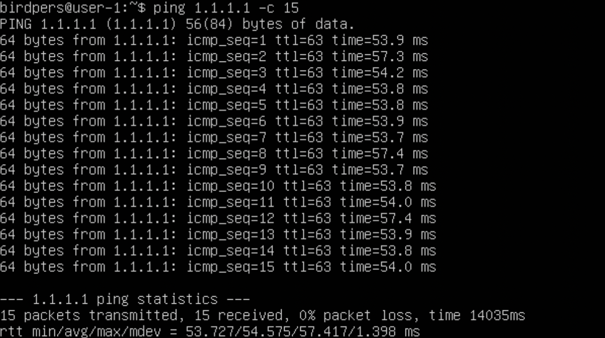
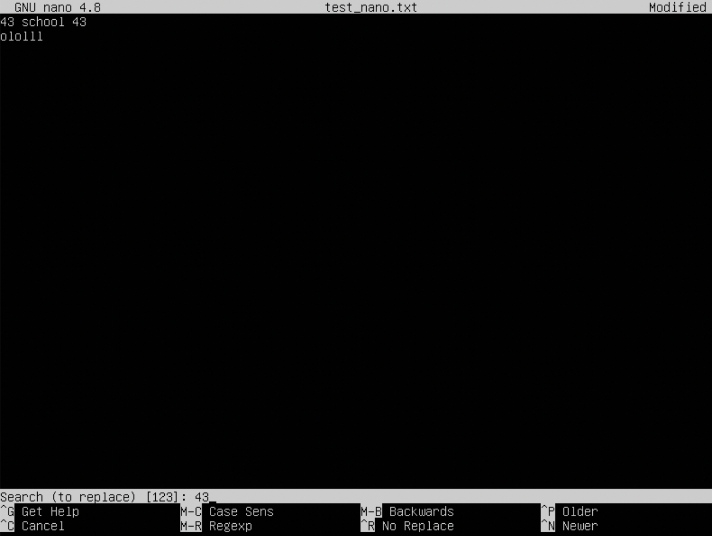
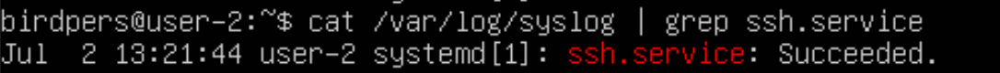

## __Part 1. Установка ОС__
---
* На скриншоте ниже указана установленная версия Ubuntu

## __Part 2. Создание пользователя__
---
* На скришоте ниже видно нового пользователя с ником ___new_user___

## __Part 3. Настройка сети ОС__
---
1. Чтобы указать новое имя для машины надо:
   * Прописать команду: ___sudo hostnamectl set-hostname user-1___
   * Затем редактировать файл: ___sudo vi /etc/hosts___
   * И строку "___127.0.0.1 старое_имя___", изменить на: "___127.0.0.1 user-1___"

2. Поставить текущий часовой пояс: ___sudo timedatectl set-timezone Asia/Novosibirsk___

3. Вывод названия всех сетевых интерфейсов: ___ip link show___
    
    > _loopback - официальный стандарт, неотъемлемая часть unix/linux системы, не важно, серверной или настольной. нужен для работы многих приложений, для тестирования итд. Это логический интерфейс внутри маршрутизатора. Он считается программным интерфейсом, который автоматически переводится в состояние up (активен) во время работы маршрутизатора.

4.  Получение ip адреса устройства, от DHCP сервера: ___ip r | grep default___
    > _DHCP = Dynamic Host Configuration Protocol_

5.  Команды для получения адресов:
    + внешний ip адрес ___wget -O - -q icanhazip.com___
    + внутренний ip адрес ___hostname -I___

6.  Редактируем файл ___sudo vim /etc/netplan/00-installer-config.yaml___ и получаем:
    + 
    + Результат редактирования:
    
    + Пинг адреса 1.1.1.1:
    
    + Пинг адреса ya.ru:
    
## __Part 4. Обновление ОС__
---
+ На скриншоте ниже показаны доступные пакеты для обновления

## __Part 5. Использование команды sudo__
---
* Чтобы дать new_user права __sudo__ нужно добавить его в группу _sudo_, с помощью команды ___usermod -aG sudo new_user___

> Назначение _sudo_ (Substitute User and do, «подменить пользователя и выполнить») — выполнить команду от имени другого пользователя, обычно от root. Смысл выполнения команды от root в том, что у него повышенные права доступа и, применяя sudo, обычный пользователь может выполнить те действия, на которые у него недостаточно прав.
* На скриншоте ниже показано новое имя для хоста __user-2__, измененное от имени нового пользователя

## __Part 6. Установка и настройка службы времени__
---
* Чтобы установить автоматическую синхронизацию нужно ввести следующие команды: 
    * _sudo unlink /etc/localtime__
    * _sudo ln -s /usr/share/zoneinfo/Asia/Novosibirsk /etc/localtime_
+ Текущий часовой пояс 

+ Вывод команды __timedatectl show__:

* Текущее время:

## __Part 7. Установка и использование текстовых редакторов__
---
* Команда для установки редактора: "___sudo apt install X___". Где ___Х___ - название редактора.
### ___1. Сохранить и выйти___ 
* На скриншоте ниже показано состояния редактора _VIM_ перед его сохранением и закрытием. Чтобы выйти из редактора, сначала нужно выйти из режима редактирования нажатием на __ESC__, затем нужно прописать команду "___:wq!___".

* На скриншоте ниже показано состояния редактора _NANO_ перед его закрытием. Чтобы выйти из редактора, нужно нажать сочетание клавиш __Ctrl+X__, затем клавишу __Y__ для сохранения изменений и __Enter__.

* На скриншоте ниже показано состояния редактора _MCEDIT_ перед его закрытием. Чтобы выйти из редактора, нужно нажать клавишу __ESC__, после этого вылезет окно с уведомлением о его закрытии, и нажать __Да__.

### ___2. Выйти без сохранения___ 
* На скриншоте ниже показано состояния редактора _VIM_ перед его закрытием. Чтобы выйти из редактора без сохранения, сначала нужно выйти из режима редактирования нажатием на __ESC__, затем нужно прописать команду "___:q!___".

* На скриншоте ниже показано состояния редактора _NANO_ перед его закрытием. Чтобы выйти из редактора без сохранения, нужно нажать сочетание клавиш __Ctrl+X__, затем клавишу __N__.

* На скриншоте ниже показано состояния редактора _MCEDIT_ перед его закрытием. Чтобы выйти из редактора без сохранения, нужно нажать клавишу __ESC__, после этого вылезет окно с уведомлением о его закрытии, и нажать __Нет__.

### ___3. Поиск и замена слова___
#### __VIM__
* На скриншоте ниже показано состояние редактора _VIM_ при нахождении искомого слова. Чтобы найти слово, сначала нужно выйти из режима редактирования нажатием на __ESC__, затем нужно прописать команду "___/Х___", где Х искомое слово.

* На скриншоте ниже показано состояние редактора _VIM_ перед заменой "_school_" на "_bird_". Чтобы найти слово, сначала нужно выйти из режима редактирования нажатием на __ESC__, затем нужно прописать команду "___:s/X/Y___", где Х посковое слово, а Y новое слово.

#### __NANO__
* На скриншоте ниже показано состояния редактора _NANO_ перед поиском слова "21". Чтобы найти слово нужно нажать сочетание клавиш __Ctrl+W__, затем ввести искомое слово и нажать __Enter__.

* На скриншоте ниже показано состояния редактора _NANO_ при вводе искомого слова "43" и перед вводом нового слова для замены. Чтобы заменить слово нужно нажать сочетание клавиш __Ctrl+\\__, затем ввести заменяемое слово, нажать __Enter__, и ввести новое слово, нажать __Enter__ и __Y__.

#### __MCEDIT__
* На скриншоте ниже показано состояния редактора _MCEDIT_ перед поиском "school" в тексте. Чтобы найти слово нужно нажать сочетание клавиш "__Fn+F7__", затем ввести поисковое слово, затем навести и нажать "_Найти всё_".

* На скриншоте ниже показано состояние редактора _MCEDIT_ перед заменой "hool" на "ript" в тексте. Чтобы заменить слово нужно нажать сочетание клавиш "__Fn+F9__", потом выбрать вкладку "_Поиск_" и в выпадающем списке нажать на "_Заменить..._", затем ввести заменяемое слово и новое слово, далее нажать __Enter__.

## __Part 8. Установка и базовая настройка сервиса SSHD__
---
1. Установка службы sshd: ___sudo apt install openssh-server___
2. Добавление в автостарт: ___sudo systemctl enable ssh___
3. Чтобы перенастроить службу на порт 2022, нужно редактировать файл: ___sudo vi /etc/ssh/sshd_config___
    + Изменить строку "#Port 22" на "Port 2022"
4. Посмотреть процесс ssh: ___ps -e | grep -i ssh___
    + ___ps___ - показать текущие процессы на сервере
    + -е показать все запущенные процессы, grep - показать только ssh процессы
5. __reboot__ перезагрузка
6. Установка netstat: ___sudo apt install net-tools___
    + На скриншоте ниже вывод команды: ___netstat -tan__

    + ключ ___-t___ Отображение TCP. Состояние соединения по протоколу передачи
    + ключ ___-a___ Показывать состояние всех сокетов
    + ключ ___-n___ Использовать сетевой IP-адрес вместо имени, чтобы показать сетевое соединение
    + ___Proto___ - Протокол, используемый сокетом
    + ___Recv-Q___ - Счётчик байт не скопированных программой пользователя из этого сокета
    + ___Send-Q___ - Счётчик байтов, не подтверждённых удалённым узлом
    + ___Local Address___ - Адрес и номер порта локального конца сокета. Если не указана опция --numeric (-n), адрес сокета  преобразуется в каноническое имя узла (FQDN), и номер порта преобразуется в соответствующее имя службы
    + ___Foreign Address___ - Адрес и номер порта удалённого конца сокета
    + ___State___ - Состояние сокета
## __Part 9. Установка и использование утилит top, htop__
---
### ___top___
* На скриншоте ниже вывод команды top, отсортированной по _MEM_:

+ uptime 1.57
+ Количество активных пользователей - 1
+ Общая загрузка системы нулевая
+ Загрузка ЦП - 0,2%
+ Загрузка памяти: из 3931.7 МБ используется 169.7 Мб и кэшировано 652.2 Мб
+ PID процесса, занимающего больше всего памяти: 642
+ PID процесса, занимающего больше всего процессорного времени: 642
### ___htop___
1.  * На скриншоте ниже видно отсортированные процессы по __PID__

    * На скриншоте ниже видно отсортированные процессы по __PERCENT_CPU__:

    * На скриншоте ниже видно отсортированные процессы по __PERCENT_MEM__:

    * На скриншоте ниже видно отсортированные процессы по __TIME__:

2. На скриншоте ниже видно отфильтрованные процессы по __ssh__:

3. На скриншоте ниже видно найденный процесс __syslog__:
 
4. На скриншоте ниже видно дополнительный вывод __hostname__, __clock__ и __uptime__

## ___Part 10. Использование утилиты fdisk___
---
+ На скриншоте ниже вывод утилиты __fdisk___

* Название диска: __VBOX HARDISK__
* Размер диска: 13 гб
* Количество секторов: 27262976
* Раздел __swap__ отсутствует
## ___Part 11. Использование утилиты df___
---
### ___df___
1. На скриншоте ниже показан вывод утилиты __df__ для корневого раздела

    * Размер раздела: ___13348936 Кб___
    * Размер занятого пространства: ___5913496 Кб___
    * Размер свободного пространства: ___6737636 Кб___
    * Процент использования: ___47%___
2. Единица измерения в выводе: килобайты
### ___df -Th___
1. На скриншоте ниже показан вывод утилиты __df__ для корневого раздела 

    * Размер раздела: ___13 Гб___
    * Размер занятого пространства: ___5.7 Гб___
    * Размер свободного пространства: ___6.5 Гб___
    * Процент использования: ___47%___
2. Тип файловой системы: ___ext4___
## ___Part 12. Использование утилиты du___
---
1. На скриншоте ниже показан запуск утилиты __du__ 

2. На скриншоте ниже вывод размера директории __home__

3. На скриншоте ниже вывод размера директории __var__

4. На скриншоте ниже вывод размера директории __var/log__

5. На скриншоте ниже вывод размера каждого элемента директории __var/log__

## __Part 13. Установка и использование утилиты ncdu__
---
* Установка утилиты __ncdu__: ___sudo apt install ncdu___
1. На скриншоте ниже вывод размера директории __home__

2. На скриншоте ниже вывод размера директории __var__

3. На скриншоте ниже вывод размера директории __var/log__

## __Part 14. Работа с системными журналами__
---
* На скриншоте ниже видно последний успешный вход в систему

1. Дата и время последней успешной авторизации: ___Jul 2 13:08:59___
    + Пользователь: ___birdpers___
    + Метод входа в систему: ___LOGIN___
2. Рестарт службы SSHd: ___sudo service ssh restart___
3. На скриншоте ниже видно сообщение о рестарте службы SSHd
    
## __Part 15. Использование планировщика заданий CRON__
---
1. Чтобы добавить задачи в __CRON__, нужно сделать редактировать файл _crontab_, через ___crontab -e___
    + На скриншоте ниже видно системный журнал и выполнение команды __uptime__ два раза
    
    + На скриншоте ниже видно все задачи __CRON__
     
2. Удалить все задачи из __CRON__: ___crontab -r___. На скриншоте ниже видно задачи __CRON__ после их удаления 
    

