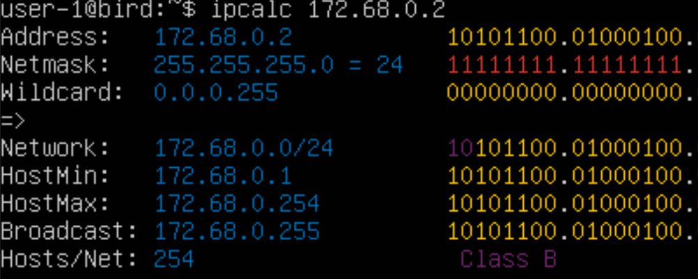
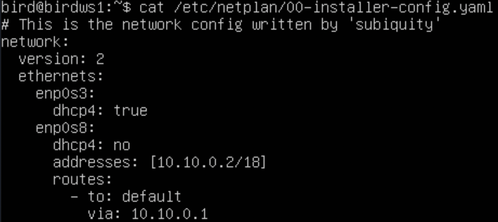
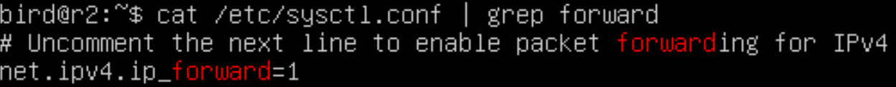
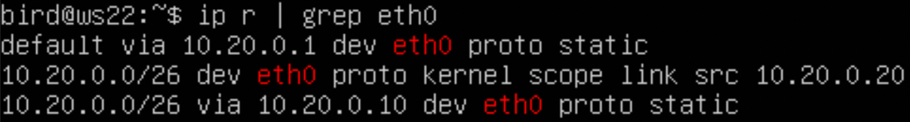
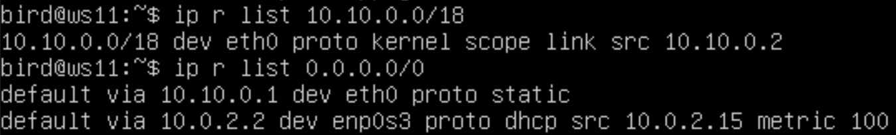
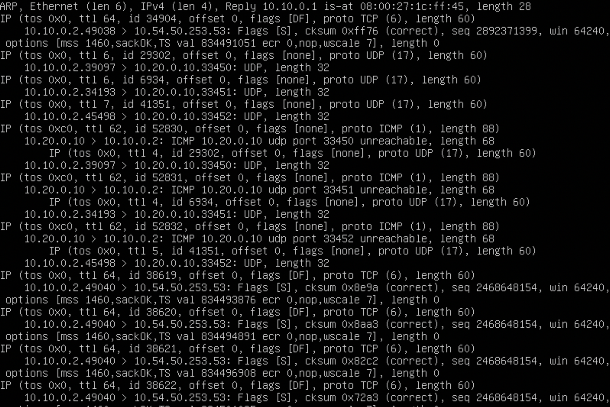
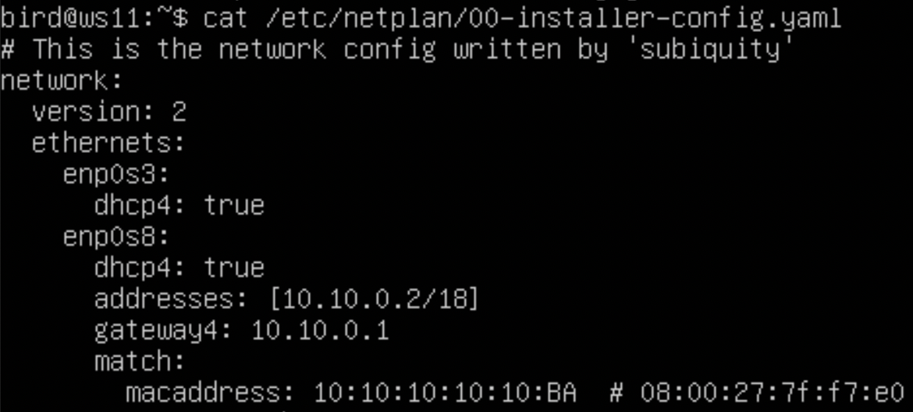

## __Part 1. Инструмент ipcalc__
---
### ___1. Сети и маски___
+ ___sudo apt install ipcalc___ - установка _ipcalc_
    1. На скриншоте ниже, вывод команды: __ipcalc 192.167.38.54/13__
    
        + Адрес сети - __192.160.0.0/13__
    2. На скриншоте ниже, вывод команды: __ipcalc 255.255.255.0__
        
        + Префиксная запись: __24__
        + Двоичная запись: __11111111.11111111.11111111.00000000__
    
    * На скриншоте ниже, вывод команды: __ipcalc 15__
        
        * Обычная запись - __255.254.0.0__
        + Двоичная запись - __11111111.11111110.00000000.00000000__
    
    * Перевод __11111111.11111111.11111111.11110000__ 
        + В обычную запись - __255.255.255.240__
        + В префиксную запись - __24__
        > __ipcalc__ не принимает в качестве аргумента двоичную запись
    3. На скриншоте ниже, вывод команды: __ipcalc 12.167.38.4/8__
        
        * Минимальный хост: __12.0.0.1__
        + Максимальный хост: __12.255.255.254__
    + На скриншоте ниже, вывод команды: ipcalc 12.167.38.4/255.255.0.0 (11111111.11111111.00000000.00000000)
    
        * Минимальный хост: __12.167.0.1__
        + Максимальный хост: __12.167.255.254__
    + На скриншоте ниже, вывод команды: ipcalc 12.167.38.4/255.255.254.0
    
        * Минимальный хост: __12.167.38.1__
        + Максимальный хост: __12.167.39.254__
    + На скриншоте ниже, вывод команды: ipcalc 12.167.38.4/4
    
        * Минимальный хост: __0.0.0.1__
        + Максимальный хост: __15.255.255.254__
### ___2. localhost___
* Адреса 194.34.23.100 и 128.0.0.1 не пингуются
+ На скриншоте ниже, пинг адреса __127.0.0.2__

+ На скриншоте ниже, пинг адреса __127.1.0.1__

### ___3. Диапазоны и сегменты сетей___
1. Публичные и частные адреса
    + __10.0.0.45__ - частный. На скриншоте ниже вычисление адреса
    
    + __134.43.0.2__ - публичный. На скриншоте ниже вычисление адреса
    
    + __192.168.4.2__ - частный. На скриншоте ниже вычисление адреса
    
    + __172.20.250.4__ - частный. На скриншоте ниже вычисление адреса
    
    + __172.0.2.1__ - публичный. На скриншоте ниже вычисление адреса
    
    + __192.172.0.1__ - публичный. На скриншоте ниже вычисление адреса
    
    + __172.68.0.2__ - публичный. На скриншоте ниже вычисление адреса
    
    + __172.16.255.255__ - частный. На скриншоте ниже вычисление адреса
    
    + __10.10.10.10__ - частный. На скриншоте ниже вычисление адреса
    
    + __192.169.168.1__ - публичный. На скриншоте ниже вычисление адреса
    
2. На скриншоте ниже вывод: __ipcalc 10.10.0.0/18                                                           
 
+ Возможные адреса __10.10.0.0/18__: 
    + _10.10.0.2_
    + _10.10.10.10_

## __Part 2. Статическая маршрутизация между двумя машинами__
---
+ На скриншоте ниже вызов команды в _ws1_: __ip a__

+ На скриншоте ниже вызов команды в _ws2_: __ip a__

* На скриншотах выше видно новые интерфейсы с именем _enp0s8_ внутренней сети на обоих машинах. Флаги состояния указаны как __DOWN__. Чтобы их поднять нужно прописать команду: ___ip link set enp0s8 up___
* На скриншоте ниже отредактированный yaml файл в ws1

* На скриншоте ниже отредактированный yaml файл в ws2

* На скриншоте вызов команды __sudo netplan apply__ (никакого вывода на машинах не было)

### __1. Добавление статического маршрута вручную__
* Чтобы добавить статический маршрут от одной машины до другой и обратно, нужно использовать команду:
    + на ws1: ___sudo ip r add 172.24.116.8 dev enp0s8___
    + на ws2: ___sudo ip r add 192.168.100.10 dev enp0s8___
* На скриншоте вызов команды на __ping 172.24.116.8__ ws1

* На скриншоте вызов команды на __ping 192.168.100.10__ ws2

### __2. Добавление статического маршрута с сохранением__
* Перезапуск: __reboot__
* На скриншоте ниже отредактированный yaml файл в ws1

* На скриншоте ниже отредактированный yaml файл в ws2

* На скриншоте вызов команды __ping 172.24.116.8__ на ws1

* На скриншоте вызов команды __ping 192.168.100.10__ на ws2

## __Part 3. Утилита iperf3__
---
* установка _iperf_: __sudo apt install iperf3__
1. Перевод скоростей:
    + __8 Mbps = 1 MB/s__
    + __100 MB/s = 819200 Kbps (800000 Kbps)__
    + __1 Gbps = 1024 Mbps (1000 Mbps)__
2. Чтобы проверить скорость между машинами для начала нужно вызвать на втором компьтере команду: __iperf3 -s__
    * На скриншоте ниже вызов этой команды
    
    * Теперь на первом компьтере надо вызвать: __iperf3 -c 172.24.116.8__. На скриншоте ниже проверка скорости соединения _ws1_ c _ws2_
    
    * Скорость соединения ~ __5.04 Gbps__
    * На скриншоте ниже вывод на 2-ом компьтере после проверки
    
## __Part 4. Сетевой экран__
---
1. __iptables__
    * Файрволы:
        + На скриншоте ниже скрипт _firewall.sh_ на ws1
        
        + На скриншоте ниже скрипт _firewall.sh_ на ws2
        
    + Запуск скриптов:
        + На скриншоте ниже запуск скрипта на ws1
        
        + На скриншоте ниже запуск скрипта на ws2
        
    * Отличия стратегий в этом случае, т.к. правила взаимоисключающие, работать будет то правило, которое указано раньше. Второе будет игнорироваться
2. __nmap__
    * Установка __nmap__: ___sudo apt install nmap___
    * На скриншоте ниже пинг с ws1 к ws2
    
    * На скриншоте ниже вызов команды: __nmap 172.24.116.8__
    
## __Part 5. Статическая маршрутизация сети__
---
### 1. Настройка конфигураций
#### ___WS11___
* На скриншоте ниже _yaml_ файл            

* На скриншоте ниже вызов __ip -4 a__ после перезагрузки

#### ___R1___
* На скриншоте ниже _yaml_ файл

+ На скриншоте ниже вызов __ip -4 a__ после перезагрузки

#### ___R2___
+ На скриншоте ниже _yaml_ файл

+ На скриншоте ниже вызов __ip -4 a__ после перезагрузки

#### ___WS21___
+ На скриншоте ниже _yaml_ файл 

+ На скриншоте ниже вызов __ip -4 a__ после перезагрузки

#### ___WS22___
+ На скриншоте ниже _yaml_ файл 

+ На скриншоте ниже вызов __ip -4 a__ после перезагрузки

---
* Пинг машин
    + На скриншоте ниже пинг _ws22_ с _ws21_
    
    + На скриншоте ниже пинг _r1_ с _ws11_
    
### 2. Включение переадресации IP-адресов
* На скриншоте ниже вызов "__sysctl -w net.ipv4.ip_forward=1__" и вывод на _r1_

* На скриншоте ниже вызов "__sysctl -w net.ipv4.ip_forward=1__" и вывод на _r2_

* На скриншоте ниже измененный _conf_ файл на _r1_

* На скриншоте ниже измененный _conf_ файл на _r2_

### 3. Установка маршрута по-умолчанию
#### ___WS11___
* На скриншоте ниже отредактированный _yaml_ файл

* На скриншоте ниже вызов команды: __ip r__

#### ___WS21___
* На скриншоте ниже отредактированный _yaml_ файл

* На скриншоте ниже вызов команды: __ip r__

#### ___WS22___
* На скриншоте ниже отредактированный _yaml_ файл

* На скриншоте ниже вызов команды: __ip r__

---
* На скриншоте ниже пинг _r2_ c _ws11_

* На скриншоте ниже вызов команды на r2: __tcpdump -th -i eth0__. На нем видно, что пинг с ws11 доходит до r2

### 4. Добавление статических маршрутов
* На скриншоте ниже измененный _yaml_ файл на _r1_

* На скриншоте ниже измененный _yaml_ файл на _r2_

* На скриншоте ниже вызов "__ip r__" на _r1_

* На скриншоте ниже вызов "__ip r__" на _r2_

* На скриншоте ниже вызов для двух адресов: ___ip r list___

> Маршрут выбран, отличный от 0.0.0.0/0, для адреса 10.10.0.0/18, потому что нужно было указать конкретный адрес назначения для случаев по умолчанию, а не случайное назначение для случаев по умолчаниюю
### 5. Построение списка маршрутизаторов
* На скриншоте ниже вызов "__tcpdump -tnv -i eth0__" на _r1_ 

* На скриншоте ниже построение маршрута от _ws11_ до _ws21_ c помощью утилиты ___traceroute___

+ > Утилита __traceroute__ использует UDP пакеты. Она отправляет пакет с TTL=1 (Time To Live) и смотрит адрес ответившего узла, дальше TTL=2, TTL=3 и так пока не достигнет цели. Каждый раз отправляется по три пакета и для каждого из них измеряется время прохождения. Пакет отправляется на случайный порт, который, скорее всего, не занят. Когда утилита traceroute получает сообщение от целевого узла о том, что порт недоступен трассировка считается завершенной.
### 6. Использование протокола ICMP при маршрутизации
* На скриншоте ниже пинг несуществующего адреса _10.30.0.111_ c _ws11_

+ На скриншоте ниже дамп с r1 и сообщение от _ICMP_

## __Part 6. Динамическая настройка IP с помощью DHCP__
---
### __R2__
1. На скриншоте ниже отредактированный файл __dhcpd.conf__

2. На скриншоте ниже отредактированный файл __resolv.conf__

    + На скриншоте ниже вызов команды "__ip a__" на _ws21_, после перезагрузки _ws22_ и службы _DHCP_ на _r2_
    
    + На скриншоте ниже ping _ws22_ c _ws21_
    

### __R1__
* На скриншоте ниже измененный _yaml_ файл от ws11 с новым мак-адресом

1. На скриншоте ниже отредактированный файл __dhcpd.conf__

2. На скриншоте ниже отредактированный файл __resolv.conf__

    * На скриншоте ниже вызов команды "__ip a__" на _ws11_, после перезагрузки службы _DHCP_ на _r1_
    
    + На скриншоте ниже пинг _ws22_ c _ws11_
    
3. Для обновления IP используется команда "__sudo dhclient eth0__".
    + На скриншоте ниже показан IP до обновления и после обновления
    
## __Part 7. NAT__
---
+ Установить _apache2_: __sudo apt-get install apache2__
* На скриншоте ниже измененный файл _ports.conf_ на _ws22_

+ На скриншоте ниже измененный файл _ports.conf_ на _r1_

+ На скриншоте ниже вызов "__service apache2 start__" на _ws22_

+ На скриншоте ниже вызов "__service apache2 start__" на _r1_

### __firewall__
+ На скриншоте ниже _firewall.sh_ от _r2_ c новыми добавленными правилами

+ На скриншоте ниже запуск _firewall.sh_ от _r2_                                                     

+ На скриншоте ниже пинг _ws22_ c _r1_. На нем видно, что пинг не проходит

* На скриншоте ниже _firewall.sh_ от _r2_ с разрешением на маршрутизацию всех ICMP пакетов

* На скриншоте ниже пинг _ws22_ c _r1_. На нем видно, что пинг проходит

### __DNAT и SNAT__
+ На скриншоте ниже firewall.sh на _r2_ с включенным _DNAT_ и _SNAT_

+ На скриншоте ниже проверка соединения _ws22_ c _r1_ по _TCP_ для _SNAT_

+ На скриншоте ниже проверка соединения _r1_ c _r2_ по _TCP_ для _DNAT_

## __Part 8. Дополнительно. Знакомство с SSH Tunnels__
---
+ Установка сервиса sshd: __sudo apt install openssh-server__
1. Запуск сервера apache2 на ws22: __sudo service apache2 start__
2. Чтобы получить доступ к веб-серверу на _ws22_ с _ws21_ нужно использовать команду: ___ssh -L 8080:localhost:80 10.20.0.20___. Через локальный порт 8080 идет подключение к веб-серверу на 80 порту по адресу 10.20.0.20
    + На скриншоте ниже подключение с _ws21_ к веб-серверу на _ws22_
    
    + Переключение на _ws21_ на 2-ой на терминал сочетанием клавиш "__Fn+Alt+F2__" (__Fn+option+F2__)
    + На скриншоте ниже проверка подключения к _ws22_ c _ws21_ при помощи telnet
    
3. Чтобы получить доступ к веб-серверу на _ws22_ с _ws11_ нужно использовать команду: ___ssh -R 8080:localhost:80 10.10.0.2___. Обратное подключение от _ws22_. Прокидывание удаленного порта 8080 к адресу 10.10.0.2 и его соединение с веб-сервером с портом 80
    + На скриншоте ниже соединение _ws11_ с _ws22_
    
    + На скриншоте ниже проверка подключения к _ws22_ c _ws11_ при помощи telnet
    
    ---
