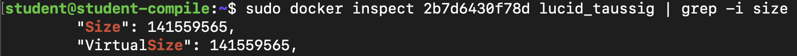
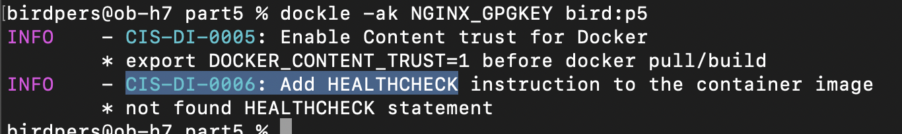

## __Part 1. Готовый докер__
---
+ Скачивание __nginx__

+ Проверка докер образа __nginx__

+ Запуск образа

+ Проверка запуска контейнера

+ Вывод информации о контейнере

    + Размер контейнера: __141559565 байт__
    
    + Замапленные порты контейнера: __80__
    
    + __IP__ контейнера: __172.17.0.2__
    
+ Остановка работы контейнера и проверка остановки

+ Запуск докера с замапленными портами 80 и 443

+ Проверка страницы nginx

+ Перезагрузка контейнера и проверка запуска

## __Part 2. Операции с контейнером__
---
+ _Вход в контейнер с помощью_ __exec__

+ _Чтение файла_ __nginx.conf__

+ _Новый __nginx.conf__ на локальной машине с выдачей статуса страницы_

+ _Копирование файла nginx в контейнер и его перезагрузка_

+ _Проверка выдачи страницы со статусом сервера_

+ _Команда для экспорта контейнера в файл_
  * __docker export silly_swartz > container.tar__
+ _Команда для остановки контейнера_
  * __docker stop 65e1d42bb390 silly_swartz__
+ _Удаление образа_
  
+ _Удаление остановленного контейнера_

  
+ _Импорт контейнера обратно_
  
+ _Запуск контейнера_
  
+ _Проверка страницы со статусом_

  
## __Part 3. Мини веб-сервер__
---
* Страница веб-сервера на Си
  
* Запуск образа с замапленным 81 портом
  
* Обновление ОС внутри контейнера

* Копирование конфигурационного файла и веб-сервера в контейнер
  + __docker cp nginx.conf "ID_CONT":/etc/nginx/__
  + __docker cp webserver.c "ID_CONT":/__
+ Установка компилятора, библиотеки и FastCGI
  * __docker exec "ID_CONT" apt-get install -y gcc spawn-fcgi libfcgi-dev__
+ Компиляция мини-сервера с выводом "Hello world"
  + __docker exec "ID_CONT" gcc webserver.c -lfcgi -o server__
+ Запуск spawn-fcgi на 8080 порту
  + __docker exec "ID_CONT" spawn-fcgi -p 8080 server__
+ Перезагрузка nginx внутри контейнера
  + __docker exec "ID_CONT" nginx -s reload__
+ Проверка страницы

  
## __Part 4. Свой докер__
---
* Содержимое докерфайла

  
* Скрипт для запуска веб сервера

  
* Построение образа
  
* Запуск с маппингом 81 порта на 80 и маппингом папки __./nginx__ и проверка запуска
  
* Проверка страниц сервера
  
## __Part 5. Dockle__
---
* Установка Dockle на Мас: ___brew install goodwithtech/r/dockle___
* Сборка контейнера: ___docker build -t bird:p5 .___
* Ошибка хранения секретов: ___dockle -ak NGINX_GPGKEY bird:p5___
* Содержимое докерфайла:
  
+ Вывод dokcle
  
## __Part 6. Базовый Docker Compose__
---
* Содержимое файла __docker-compose.yml__

  
* Запуск образов и проверка страницы
  
